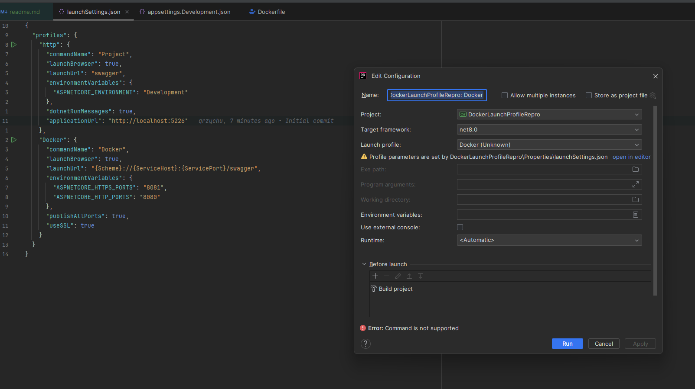

In VisualStudio, when I debug the Docker launchProfile, everything works fine

In Dockerfile, the purpose of `ARG MICROSOFT="this won't work"` is to simulate our production Dockerfiles, where we supply the IP of our cache server.

In local builds, we want to use the public Microsoft registry, so we use the dotnet Docker instrumentation to override the value

However, in Rider, we get the following error:

